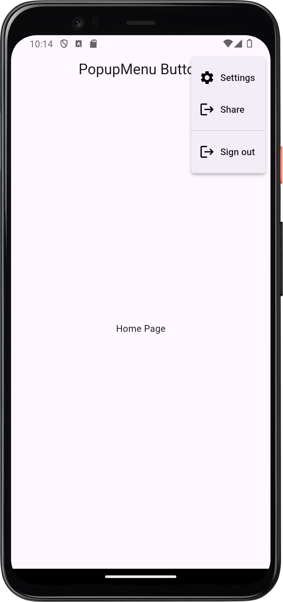
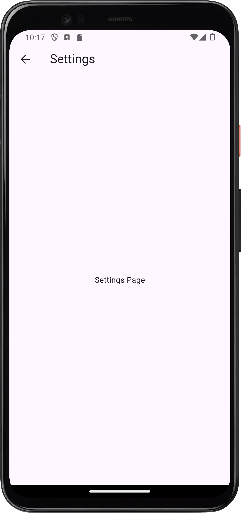

# Popup Menu Button Demo

A simple Flutter demo showcasing the **PopupMenuButton** widget.

## 🚀 Run Instructions
1. Clone the repo:
   ```bash
   > git clone https://github.com/ai-ngabo/Popup_Menu_Button.git 
   ```
   
2. Navigate into the project:
   ```bash
   > cd Popup_Menu_Button
   ```
    
3. Run the app:
   ```bash
   > flutter run
   ```

## 🎯 Widget Attributes

This demo highlights three properties of :
1. 	**itemBuilder** – defines the list of menu items shown when the button is tapped.
2. 	**onSelected** – callback triggered when a menu item is chosen.
3. 	**icon** – customizes the icon displayed for the popup menu button.
      Each property is demonstrated live in the app.

## 📸 Screenshots




## 📅 Presentation Date

    Presented on: [9th Febuary, 2026]
